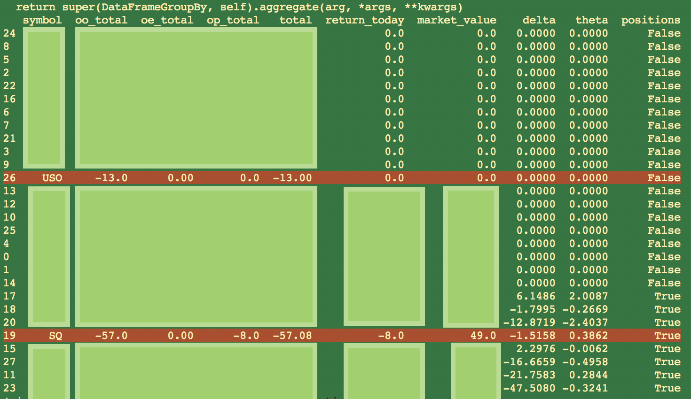

# simple_metrics for Robinhood
Simple portfolio metrics applied to your Robinhood portfolio.

## example 1

```py
from simple_metrics import fetch, export

account = {
        'username': 'my username',
        'password': 'my password'}

#
# export stock trades to -> stock_orders.csv
#
stock_orders = fetch.stock_trades(account, {})
export.stock_orders(stock_orders, {})

#
# export -> option_orders.csv
#
option_orders = fetch.option_orders(account, {})
export.option_orders(option_orders, {})
```

## example 2

Run the `calculate_options.py` script  in the examples folder, it generates total and daily returns, as well as fetching greeks for open option positions.




## install
```sh
pip install simple_metrics
```

## package api

Functionality includes:

- Fetch Stock order history
- Fetch Option order history
- Export Stock order history
- Export Option order history

## local development
Git clone this repo and run,
```bash
pip install . --process-dependency-links --editable
```

Adding `--editable` allows you to pull in code changes without
having to run `pip install`.
